# State Machine Diagrams

**Document ID**: FBMS-WP-SWE3-STD
**Version**: 1.0.0
**Date**: 2025-12-16
**Status**: Draft
**Classification**: Technical
**ASPICE Process**: SWE.3 (Software Detailed Design and Unit Construction)
**Target ASIL**: ASIL-D

---

## Document Control

### Revision History

| Version | Date       | Author                   | Description                    |
|---------|------------|--------------------------|--------------------------------|
| 1.0.0   | 2025-12-16 | PARVIS-AI-Orchestrator   | Initial state diagrams         |

---

## 1. BMS Main State Machine

### 1.1 State Diagram

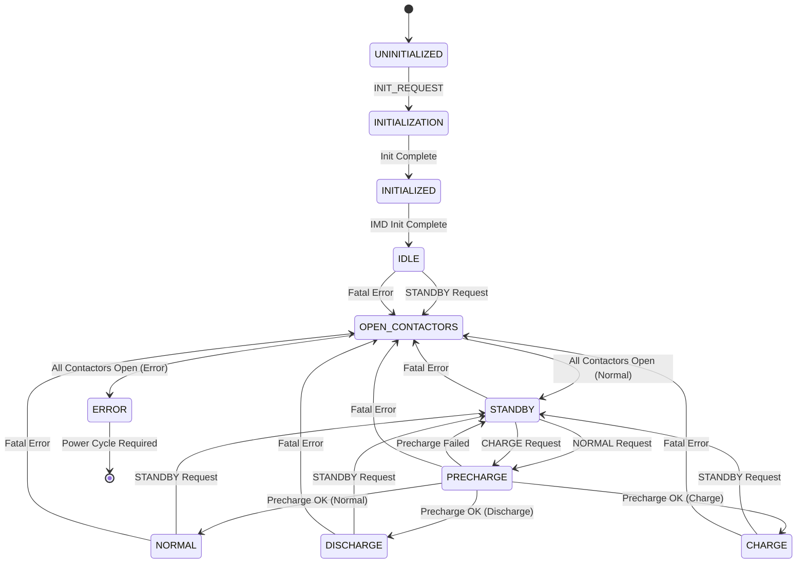

### 1.2 State Description Table

| State          | Entry Condition              | Exit Condition               | Activities                    |
|----------------|------------------------------|------------------------------|-------------------------------|
| UNINITIALIZED  | Power-on                     | INIT_REQUEST                 | Wait for init request         |
| INITIALIZATION | INIT_REQUEST received        | Init complete                | Initialize modules            |
| INITIALIZED    | Init complete                | IMD init complete            | Wait for IMD                  |
| IDLE           | IMD ready                    | STANDBY request or error     | Monitor, report via CAN       |
| OPEN_CONTACTORS| Request or error             | All contactors open          | Open contactors sequence      |
| STANDBY        | Contactors open (normal)     | NORMAL/CHARGE request        | Ready for operation           |
| PRECHARGE      | NORMAL/CHARGE request        | Precharge complete/failed    | Execute precharge sequence    |
| NORMAL         | Precharge OK (normal)        | STANDBY request or error     | Normal operation              |
| DISCHARGE      | Precharge OK (discharge)     | STANDBY request or error     | Discharge operation           |
| CHARGE         | Precharge OK (charge)        | STANDBY request or error     | Charge operation              |
| ERROR          | Fatal error + contactors open| Power cycle                  | Safe state, log error         |

---

## 2. BMS Precharge Substate Machine

### 2.1 State Diagram

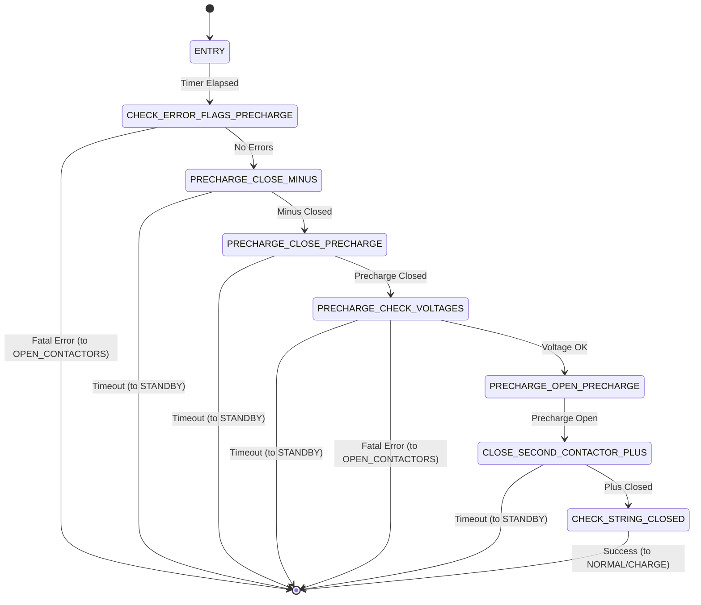

### 2.2 Precharge Timing Sequence

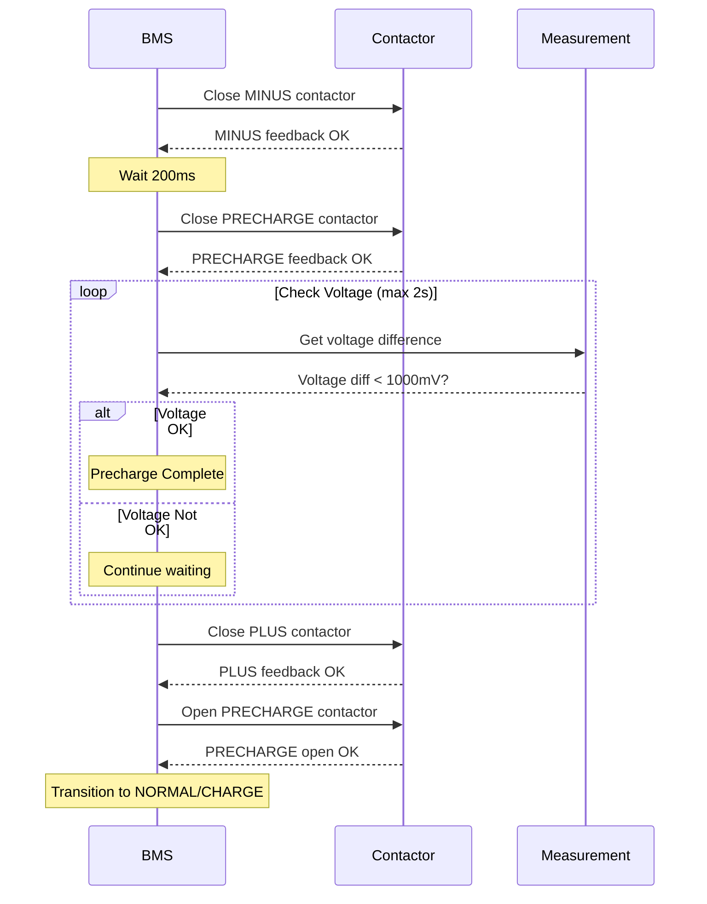

---

## 3. BMS Contactor Opening Substate Machine

### 3.1 State Diagram

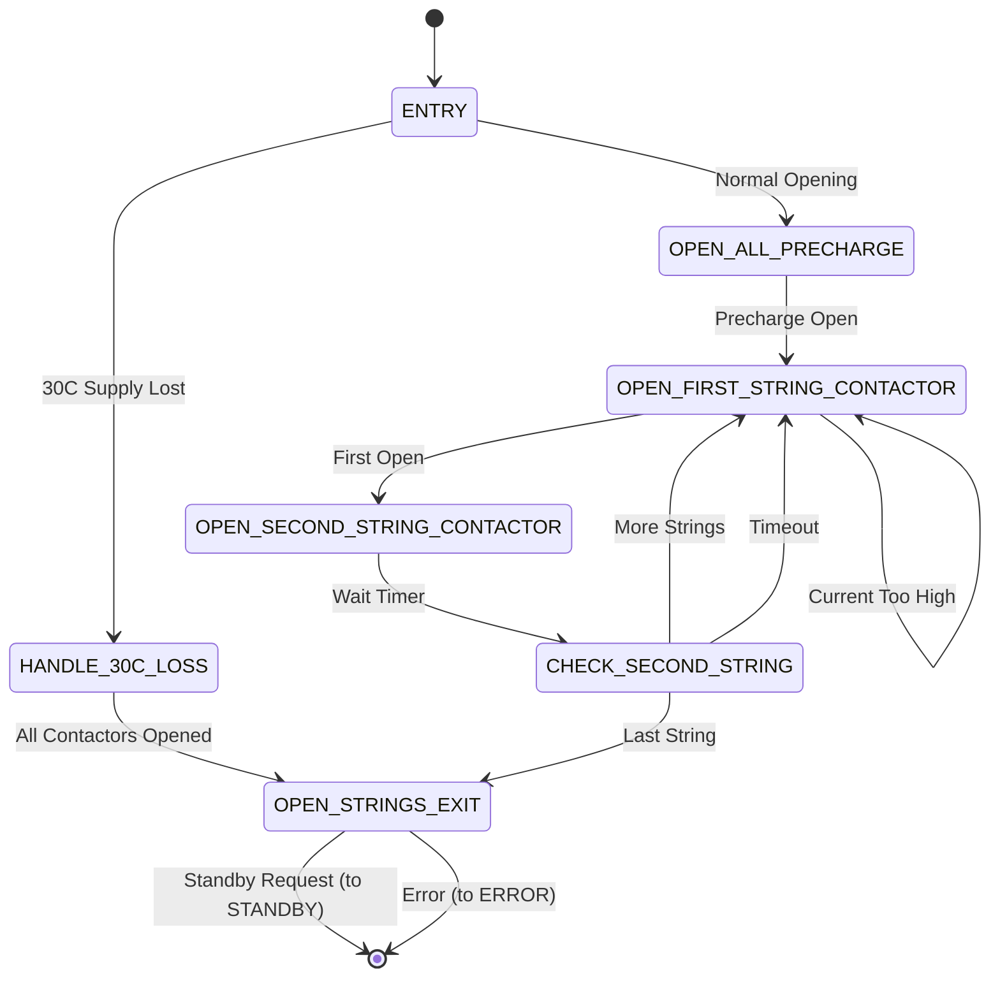

### 3.2 String Opening Sequence

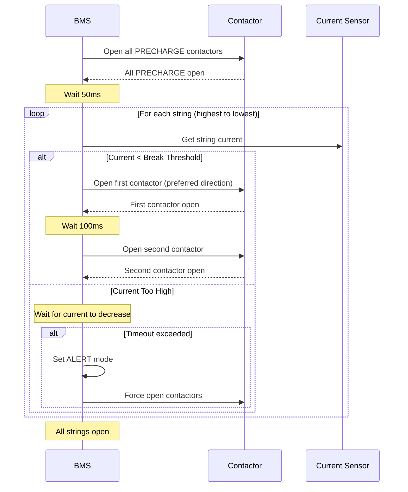

---

## 4. SBC State Machine

### 4.1 State Diagram

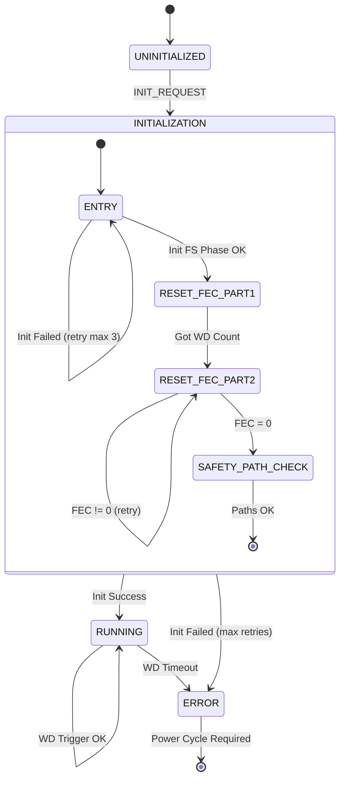

### 4.2 SBC Initialization Sequence

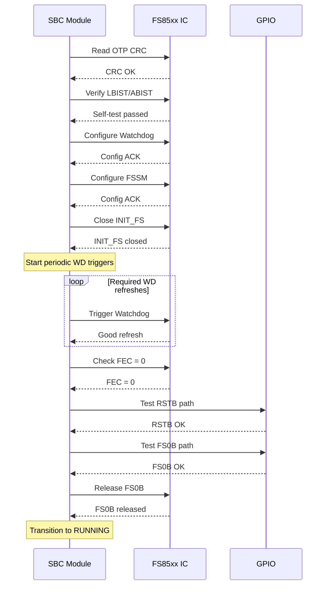

---

## 5. Contactor State Transitions

### 5.1 Single Contactor State

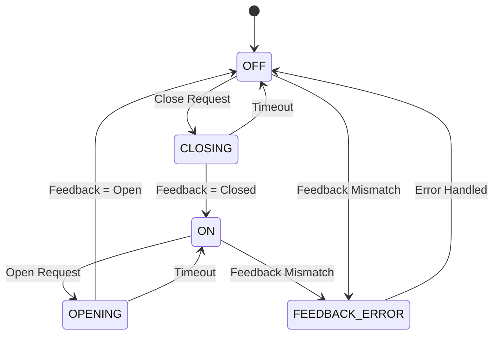

### 5.2 String Contactor Sequence

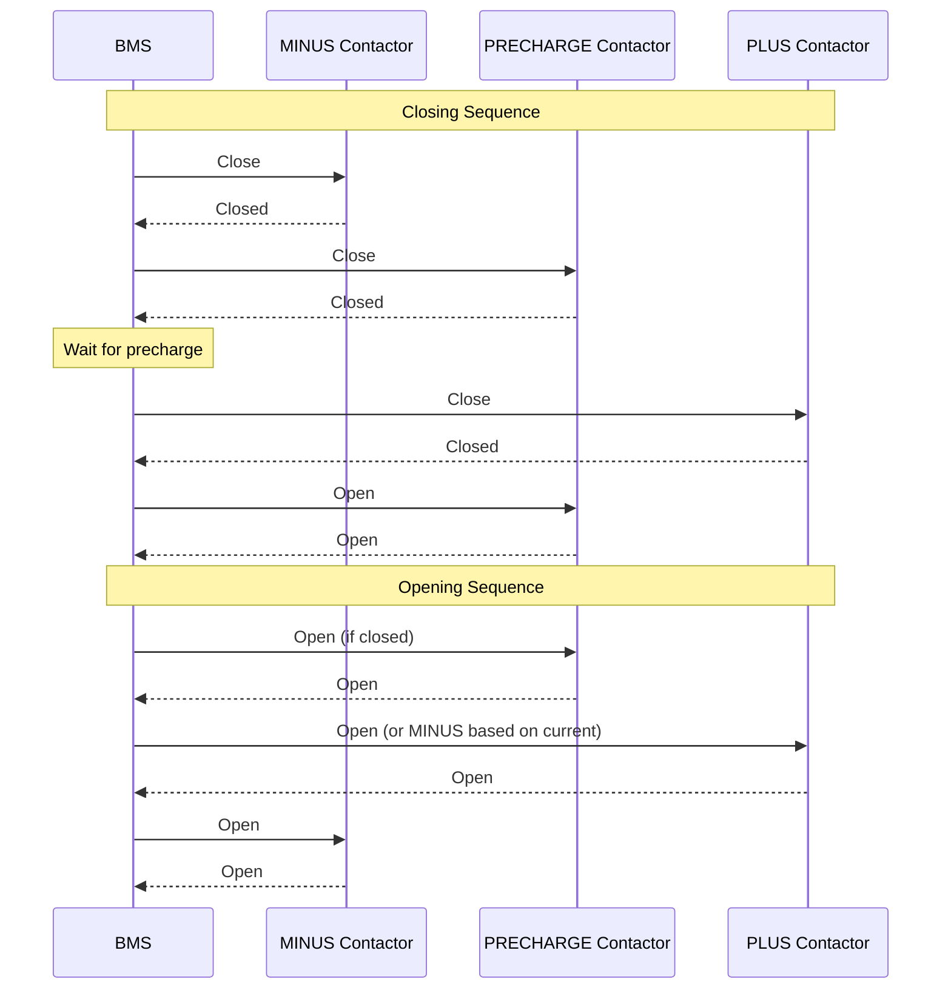

---

## 6. AFE Measurement State Machine

### 6.1 State Diagram

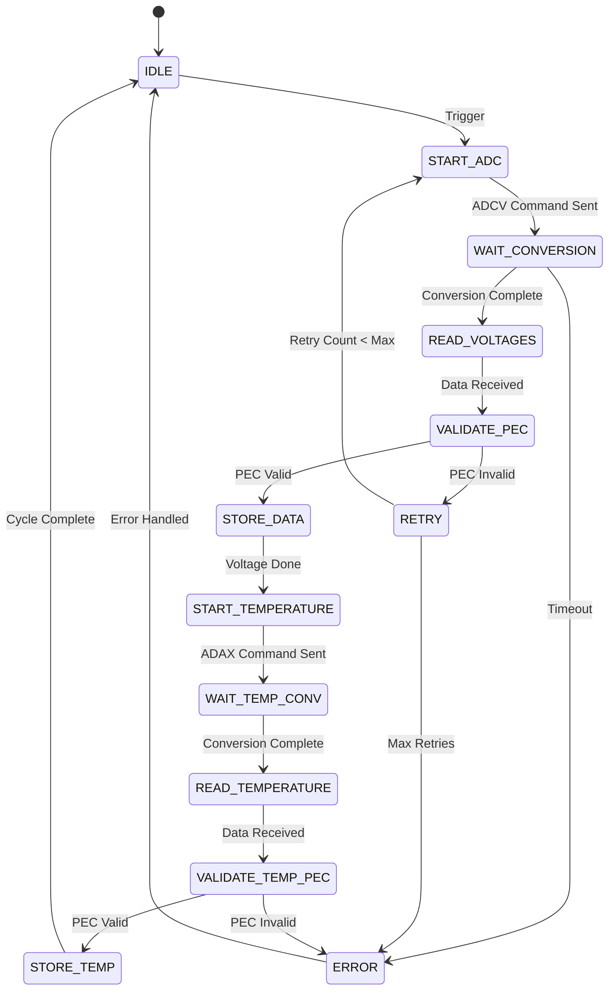

### 6.2 AFE Communication Sequence

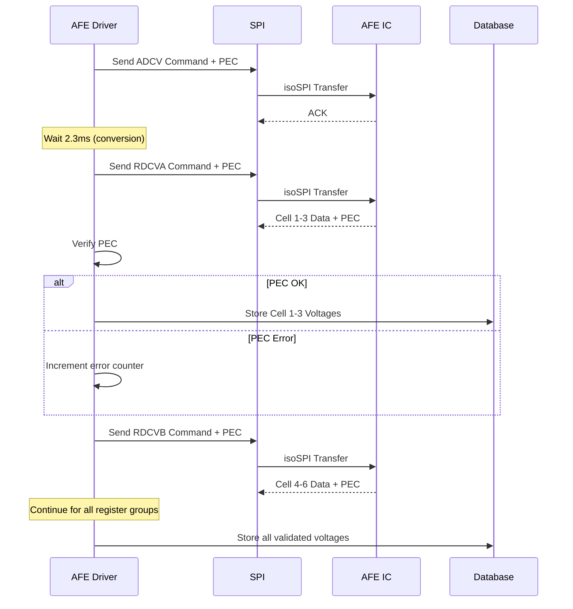

---

## 7. System Power-Up Sequence

### 7.1 Initialization Flow

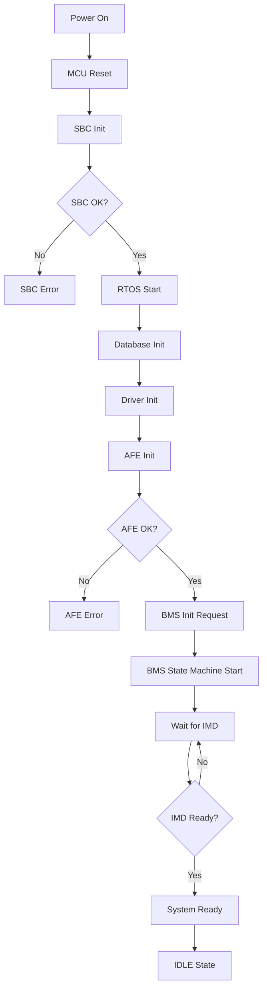

---

## 8. Error Handling Flow

### 8.1 Fatal Error Response

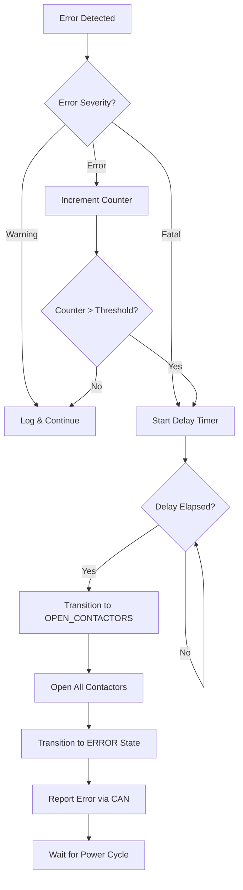

### 8.2 Error Priority Handling

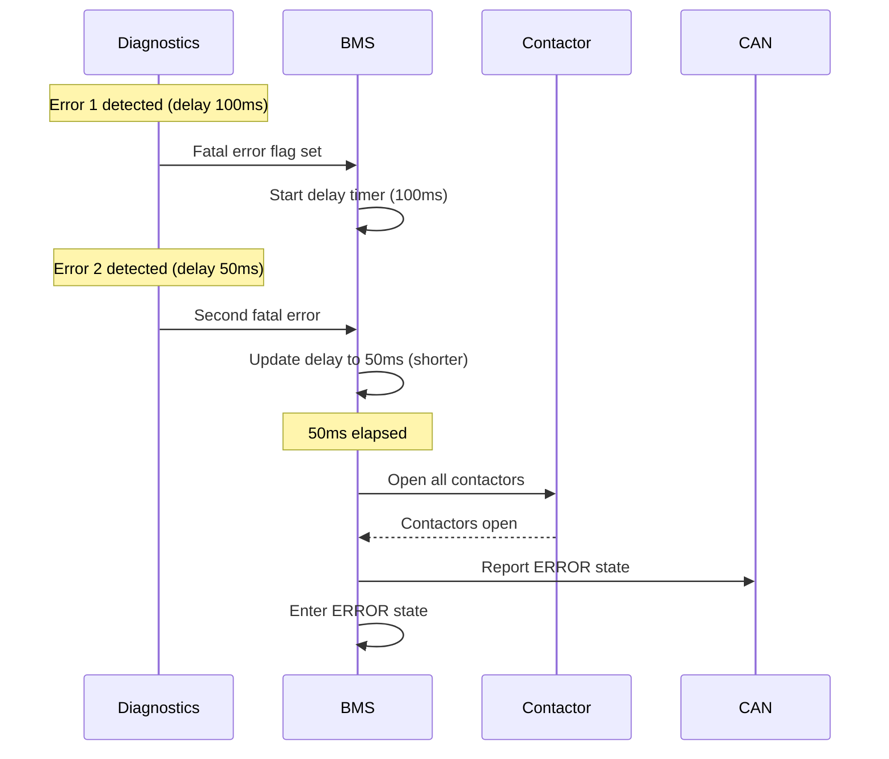

---

## 9. Watchdog Timing

### 9.1 SBC Watchdog Timing

```mermaid
gantt
    title SBC Watchdog Timing
    dateFormat X
    axisFormat %L

    section Window
    Closed Window   :done, 0, 0
    Open Window     :active, 0, 100

    section Triggers
    WD Trigger 1    :crit, milestone, 10, 0
    WD Trigger 2    :crit, milestone, 110, 0
    WD Trigger 3    :crit, milestone, 210, 0

    section Period
    Period 1        :0, 100
    Period 2        :100, 200
    Period 3        :200, 300
```

### 9.2 Task Timing Diagram

```mermaid
gantt
    title foxBMS Task Timing
    dateFormat X
    axisFormat %L

    section 1ms Task
    Task Execution :0, 1
    Task Execution :1, 2
    Task Execution :2, 3

    section 10ms Task
    BMS Trigger :0, 2
    SBC Trigger :2, 3
    CONT Check  :3, 4

    section 100ms Task
    AFE Measure :0, 5
    Algorithm   :5, 8
    SOA Check   :8, 10
```

---

**End of Document**

---

*Generated by PARVIS-AI-Orchestrator for L3 Phase (Software Detailed Design)*
*ASPICE SWE.3 Compliance*
