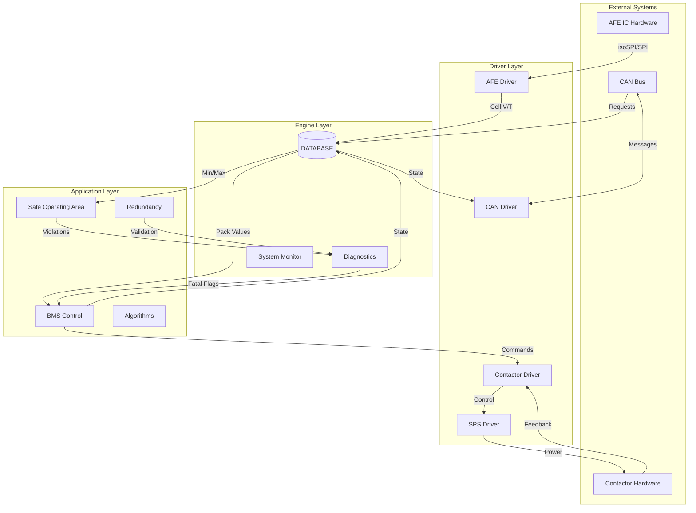
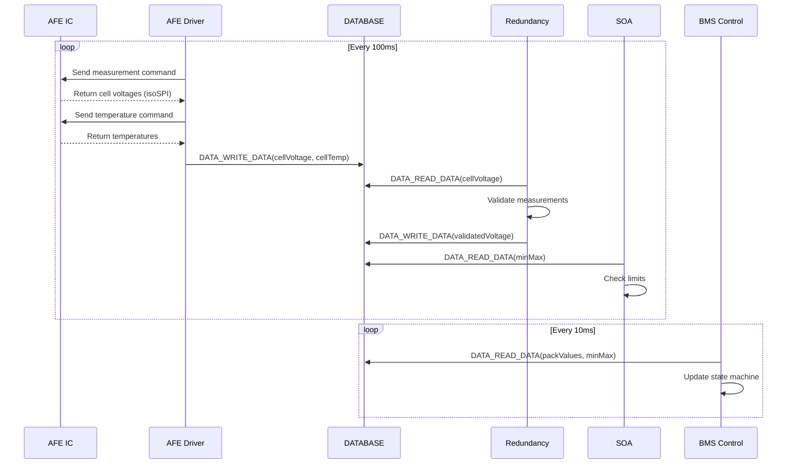
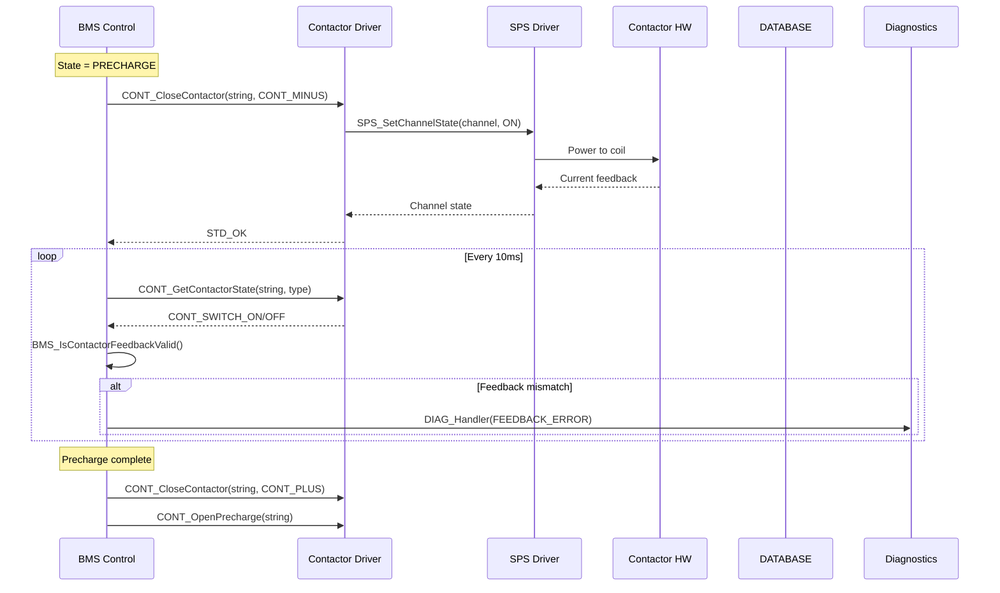
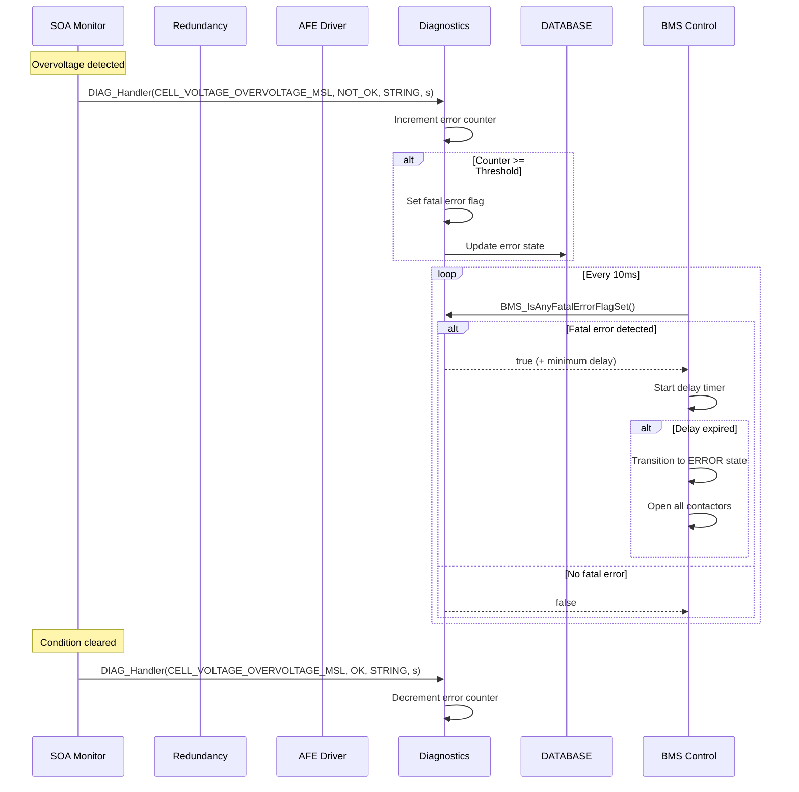
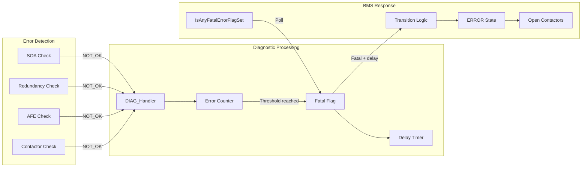
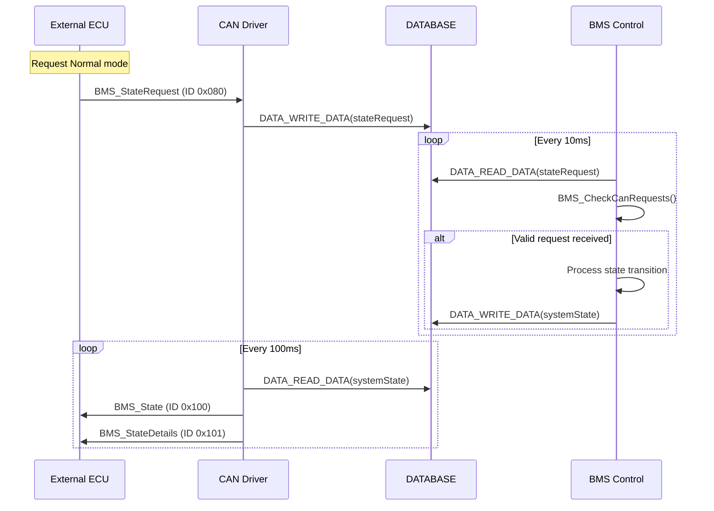
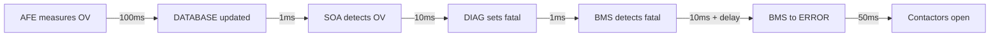

# foxBMS Data Flow Analysis - R2 Integration Verification

**Document ID**: FBMS-VER-R2-DFA-001
**Version**: 1.0.0
**Date**: 2025-12-16
**Status**: Draft
**V-Model Phase**: R2 (Integration Verification)
**ASPICE Process**: SWE.5 (Software Integration and Integration Test)
**Target ASIL**: ASIL-D

---

## Document Control

### Revision History

| Version | Date       | Author                   | Description                    |
|---------|------------|--------------------------|--------------------------------|
| 1.0.0   | 2025-12-16 | PARVIS-AIVerify-Integration | Initial data flow analysis |

### Approval

| Role                  | Name | Date | Signature |
|-----------------------|------|------|-----------|
| Integration Engineer  |      |      |           |
| Safety Manager        |      |      |           |
| Quality Manager       |      |      |           |

---

## 1. Introduction

### 1.1 Purpose

This document provides a comprehensive analysis of critical data flows between BMS components for integration verification. It identifies data paths, timing requirements, validation points, and failure modes to support integration testing per ASPICE SWE.5.

### 1.2 Scope

This analysis covers:
- Measurement data flow (AFE to BMS via DATABASE)
- Control data flow (BMS to CONTACTOR/SPS)
- Diagnostic data flow (Components to DIAG to BMS)
- State synchronization flow (BMS to CAN to External)

### 1.3 References

| Document ID | Title |
|-------------|-------|
| FBMS-WP-SWE2-001 | Software Architecture Design |
| FBMS-WP-SWE3-ICD | Interface Control Document |
| ISO 26262:2018 | Road vehicles - Functional safety |

---

## 2. Data Flow Overview

### 2.1 System Data Flow Diagram



---

## 3. Data Flow Category 1: Measurement Data Flow

### 3.1 Flow Description

**Path**: AFE IC -> AFE Driver -> DATABASE -> BMS/SOA/ALGO

**Purpose**: Acquire cell voltage and temperature measurements from Analog Front-End ICs and make them available to application components.

### 3.2 Data Flow Diagram



### 3.3 Data Structures Involved

**Source Data Block**: `DATA_BLOCK_CELL_VOLTAGE_s`
```c
typedef struct {
    DATA_BLOCK_HEADER_s header;
    int16_t cellVoltage_mV[BS_NR_OF_STRINGS][BS_NR_OF_MODULES_PER_STRING]
                          [BS_NR_OF_CELL_BLOCKS_PER_MODULE];
    bool invalidCellVoltage[BS_NR_OF_STRINGS][...];
    uint16_t nrValidCellVoltages[BS_NR_OF_STRINGS];
    int32_t stringVoltage_mV[BS_NR_OF_STRINGS];
} DATA_BLOCK_CELL_VOLTAGE_s;
```

**Derived Data Block**: `DATA_BLOCK_MIN_MAX_s`
```c
typedef struct {
    DATA_BLOCK_HEADER_s header;
    int16_t minimumCellVoltage_mV[BS_NR_OF_STRINGS];
    int16_t maximumCellVoltage_mV[BS_NR_OF_STRINGS];
    int16_t minimumTemperature_ddegC[BS_NR_OF_STRINGS];
    int16_t maximumTemperature_ddegC[BS_NR_OF_STRINGS];
} DATA_BLOCK_MIN_MAX_s;
```

**Pack Values Block**: `DATA_BLOCK_PACK_VALUES_s`
```c
typedef struct {
    DATA_BLOCK_HEADER_s header;
    int32_t packCurrent_mA;
    int32_t stringVoltage_mV[BS_NR_OF_STRINGS];
    int32_t stringCurrent_mA[BS_NR_OF_STRINGS];
    int32_t highVoltageBusVoltage_mV;
    uint8_t invalidStringVoltage[BS_NR_OF_STRINGS];
    uint8_t invalidStringCurrent[BS_NR_OF_STRINGS];
} DATA_BLOCK_PACK_VALUES_s;
```

### 3.4 Timing Requirements

| Parameter | Value | Description |
|-----------|-------|-------------|
| AFE measurement cycle | 100ms | Cell voltage/temperature update rate |
| Database update latency | <1ms | Max time for DATA_WRITE_DATA |
| Data freshness threshold | 200ms | Max age of valid measurement |
| BMS read cycle | 10ms | BMS state machine trigger period |
| First valid measurement | <500ms | Time to first valid data after init |

### 3.5 Validation Points

| Validation Point | Location | Check Performed |
|------------------|----------|-----------------|
| VP-MDF-001 | AFE Driver | PEC/CRC validation on isoSPI frames |
| VP-MDF-002 | AFE Driver | Command counter verification |
| VP-MDF-003 | DATABASE | Timestamp update verification |
| VP-MDF-004 | Redundancy | Measurement timeout detection |
| VP-MDF-005 | Redundancy | Cross-sensor plausibility |
| VP-MDF-006 | BMS | invalidStringVoltage check before use |

### 3.6 Failure Modes and Expected Responses

| Failure Mode | Detection Method | Expected Response | ASIL |
|--------------|------------------|-------------------|------|
| AFE communication timeout | Timestamp age check | DIAG_ID_BASE_CELL_VOLTAGE_MEASUREMENT_TIMEOUT | D |
| PEC error on isoSPI | CRC mismatch | Mark measurement invalid, retry | D |
| Open wire detected | AFE pull-up/down test | DIAG_ID_AFE_OPEN_WIRE, mark cell invalid | C |
| Voltage out of plausible range | Range check | DIAG_ID_PLAUSIBILITY_CELL_VOLTAGE | C |
| Redundant sensor mismatch | Cross-validation | DIAG_ID_PLAUSIBILITY_CELL_VOLTAGE | D |

### 3.7 Integration Test Mapping

| Test ID | Flow Aspect | Description |
|---------|-------------|-------------|
| IT-MDF-001 | Data acquisition | Verify cell voltage update in DATABASE within 100ms |
| IT-MDF-002 | Timestamp | Verify timestamp update on each measurement |
| IT-MDF-003 | Timeout detection | Inject communication failure, verify timeout error |
| IT-MDF-004 | Invalid data handling | Set invalidCellVoltage, verify BMS ignores value |
| IT-MDF-005 | PEC error handling | Inject PEC error, verify retry and error reporting |
| IT-MDF-006 | Data freshness | Stop AFE, verify BMS detects stale data |

---

## 4. Data Flow Category 2: Control Data Flow

### 4.1 Flow Description

**Path**: BMS Control -> CONTACTOR Driver -> SPS Driver -> Contactor Hardware

**Purpose**: Translate BMS state machine decisions into physical contactor control commands with feedback verification.

### 4.2 Data Flow Diagram



### 4.3 Data Structures Involved

**Contactor State Request** (from BMS):
```c
/* Function calls - no data structure, direct API */
STD_RETURN_TYPE_e CONT_CloseContactor(uint8_t stringNumber, CONT_TYPE_e contactor);
STD_RETURN_TYPE_e CONT_OpenContactor(uint8_t stringNumber, CONT_TYPE_e contactor);
STD_RETURN_TYPE_e CONT_ClosePrecharge(uint8_t stringNumber);
STD_RETURN_TYPE_e CONT_OpenPrecharge(uint8_t stringNumber);
```

**Contactor Feedback** (to BMS):
```c
CONT_ELECTRICAL_STATE_TYPE_e CONT_GetContactorState(uint8_t stringNumber, CONT_TYPE_e type);

typedef enum {
    CONT_SWITCH_OFF,
    CONT_SWITCH_ON,
    CONT_SWITCH_UNDEFINED,
} CONT_ELECTRICAL_STATE_TYPE_e;
```

**Error Flags in DATABASE**:
```c
/* From DATA_BLOCK_ERROR_STATE_s */
bool contactorInPositivePathOfStringFeedbackError[BS_NR_OF_STRINGS];
bool contactorInNegativePathOfStringFeedbackError[BS_NR_OF_STRINGS];
bool prechargeContactorFeedbackError[BS_NR_OF_STRINGS];
```

### 4.4 Timing Requirements

| Parameter | Value | Description |
|-----------|-------|-------------|
| Contactor command cycle | 10ms | BMS state machine period |
| Contactor close time | <50ms | Max time for contactor to close |
| Feedback check period | 10ms | Feedback validation frequency |
| Precharge timeout | 3000ms | Max time for precharge completion |
| Emergency open time | <20ms | Time to open all contactors |

### 4.5 Precharge Sequence Timing Budget

```mermaid
gantt
    title Precharge Sequence Timing
    dateFormat X
    axisFormat %L ms

    section Sequence
    Close Minus Contactor    :a1, 0, 50
    Verify Minus Closed      :a2, after a1, 10
    Close Precharge Contactor :a3, after a2, 50
    Voltage Rise Monitoring   :a4, after a3, 2000
    Voltage Verification      :a5, after a4, 10
    Close Plus Contactor     :a6, after a5, 50
    Verify Plus Closed       :a7, after a6, 10
    Open Precharge           :a8, after a7, 50
    Verify Precharge Open    :a9, after a8, 10
```



### 4.6 Validation Points

| Validation Point | Location | Check Performed |
|------------------|----------|-----------------|
| VP-CDF-001 | BMS | Contactor feedback matches command |
| VP-CDF-002 | BMS | Precharge voltage threshold check |
| VP-CDF-003 | BMS | Precharge current threshold check |
| VP-CDF-004 | BMS | Contactor close/open timeout |
| VP-CDF-005 | CONT | SPS channel state verification |

### 4.7 Failure Modes and Expected Responses

| Failure Mode | Detection Method | Expected Response | ASIL |
|--------------|------------------|-------------------|------|
| Contactor stuck closed | Feedback != command | DIAG_ID_STRING_PLUS_CONTACTOR_FEEDBACK | D |
| Contactor stuck open | Feedback != command | DIAG_ID_STRING_MINUS_CONTACTOR_FEEDBACK | D |
| Precharge failure (voltage) | Voltage diff > threshold | DIAG_ID_PRECHARGE_ABORT_REASON_VOLTAGE | D |
| Precharge failure (current) | Current > threshold | DIAG_ID_PRECHARGE_ABORT_REASON_CURRENT | D |
| Contactor timeout | Timer expiry | Transition to ERROR state | D |
| SPS channel failure | SPS feedback | Open all contactors | C |

### 4.8 Integration Test Mapping

| Test ID | Flow Aspect | Description |
|---------|-------------|-------------|
| IT-CDF-001 | Basic control | Verify contactor opens/closes on command |
| IT-CDF-002 | Feedback validation | Verify feedback state matches physical state |
| IT-CDF-003 | Precharge success | Verify complete precharge sequence timing |
| IT-CDF-004 | Precharge voltage | Inject low bus voltage, verify abort |
| IT-CDF-005 | Precharge current | Inject high current, verify abort |
| IT-CDF-006 | Feedback error | Simulate stuck contactor, verify error detection |
| IT-CDF-007 | Emergency open | Trigger fatal error, verify all contactors open |

---

## 5. Data Flow Category 3: Diagnostic Data Flow

### 5.1 Flow Description

**Path**: Component (SOA/AFE/RED) -> DIAG -> BMS (Error State)

**Purpose**: Propagate error conditions from monitoring components to the BMS state machine for appropriate response.

### 5.2 Data Flow Diagram



### 5.3 Data Structures Involved

**DIAG Handler Interface**:
```c
DIAG_RETURNTYPE_e DIAG_Handler(
    DIAG_ID_e diagId,           /* Diagnostic ID */
    DIAG_EVENT_e event,         /* DIAG_EVENT_OK or DIAG_EVENT_NOT_OK */
    DIAG_IMPACT_LEVEL_e impact, /* DIAG_SYSTEM, DIAG_STRING, DIAG_CELL */
    uint32_t data               /* Context data (e.g., string number) */
);
```

**Diagnosis Entry Configuration**:
```c
/* Severity levels */
typedef enum {
    DIAG_WARNING,       /* Logged, no action */
    DIAG_ERROR,         /* Counter-based, may trigger action */
    DIAG_FATAL_ERROR,   /* Immediate or delayed safe state */
} DIAG_SEVERITY_LEVEL_e;
```

**Error State in DATABASE**:
```c
typedef struct {
    DATA_BLOCK_HEADER_s header;
    /* Error flags for various conditions */
    bool cellVoltageOvervoltage[BS_NR_OF_STRINGS];
    bool cellVoltageUndervoltage[BS_NR_OF_STRINGS];
    bool cellTemperatureOvertemperature[BS_NR_OF_STRINGS];
    bool cellTemperatureUndertemperature[BS_NR_OF_STRINGS];
    bool overcurrentCharge[BS_NR_OF_STRINGS];
    bool overcurrentDischarge[BS_NR_OF_STRINGS];
    /* ... additional error flags ... */
} DATA_BLOCK_ERROR_STATE_s;
```

### 5.4 Timing Requirements

| Parameter | Value | Description |
|-----------|-------|-------------|
| Error detection cycle | 10-100ms | Depends on monitoring component |
| DIAG_Handler latency | <100us | Time to process DIAG call |
| Error counter threshold | Configurable | Typically 3-10 counts |
| Fatal error delay | Configurable | 0-1000ms per error type |
| Safe state transition | 10ms | BMS cycle to detect and react |

### 5.5 Error Propagation Path



### 5.6 Validation Points

| Validation Point | Location | Check Performed |
|------------------|----------|-----------------|
| VP-DDF-001 | DIAG | Error counter increment on NOT_OK |
| VP-DDF-002 | DIAG | Error counter decrement on OK |
| VP-DDF-003 | DIAG | Fatal flag set at threshold |
| VP-DDF-004 | BMS | Fatal flag polling each cycle |
| VP-DDF-005 | BMS | Delay timer countdown |
| VP-DDF-006 | BMS | State transition on delay expiry |

### 5.7 Failure Modes and Expected Responses

| Failure Mode | Detection Method | Expected Response | ASIL |
|--------------|------------------|-------------------|------|
| Cell overvoltage | SOA max voltage check | Counter increment, then fatal | D |
| Cell undervoltage | SOA min voltage check | Counter increment, then fatal | D |
| Cell overtemperature | SOA max temperature check | Counter increment, then fatal | D |
| Overcurrent | Current sensor check | Counter increment, then fatal | D |
| Measurement timeout | Timestamp age check | Counter increment, then fatal | D |
| DIAG module failure | DIAG state check | MCU reset via watchdog | D |

### 5.8 Integration Test Mapping

| Test ID | Flow Aspect | Description |
|---------|-------------|-------------|
| IT-DDF-001 | Counter increment | Inject NOT_OK event, verify counter increment |
| IT-DDF-002 | Counter decrement | Send OK event, verify counter decrement |
| IT-DDF-003 | Threshold trigger | Exceed threshold, verify fatal flag set |
| IT-DDF-004 | Delay mechanism | Verify delay timer starts on fatal detection |
| IT-DDF-005 | State transition | Verify BMS transitions to ERROR after delay |
| IT-DDF-006 | Multi-error priority | Inject multiple errors, verify shortest delay used |
| IT-DDF-007 | Error clearing | Clear condition, verify counter decrements |

---

## 6. Data Flow Category 4: State Synchronization Flow

### 6.1 Flow Description

**Path**: External (CAN) -> DATABASE -> BMS -> DATABASE -> CAN (Response)

**Purpose**: Receive state requests from external systems via CAN and transmit BMS state information.

### 6.2 Data Flow Diagram



### 6.3 Data Structures Involved

**State Request (RX from CAN)**:
```c
typedef struct {
    DATA_BLOCK_HEADER_s header;
    uint8_t stateRequestViaCan;  /* BMS_REQ_ID_STANDBY, NORMAL, CHARGE */
    uint8_t stateRequestViaCanPending;
    uint8_t previousStateRequestViaCan;
    uint8_t stateCounter;
} DATA_BLOCK_STATE_REQUEST_s;

/* Request IDs */
#define BMS_REQ_ID_NOREQ   (0u)
#define BMS_REQ_ID_STANDBY (3u)
#define BMS_REQ_ID_NORMAL  (4u)
#define BMS_REQ_ID_CHARGE  (5u)
```

**System State (TX to CAN)**:
```c
typedef struct {
    DATA_BLOCK_HEADER_s header;
    int32_t bmsCanState;  /* BMS_CAN_STATE_e value */
} DATA_BLOCK_SYSTEM_STATE_s;

typedef enum {
    BMS_CAN_STATE_UNINITIALIZED,
    BMS_CAN_STATE_INITIALIZATION,
    BMS_CAN_STATE_INITIALIZED,
    BMS_CAN_STATE_IDLE,
    BMS_CAN_STATE_OPEN_CONTACTORS,
    BMS_CAN_STATE_STANDBY,
    BMS_CAN_STATE_PRECHARGE,
    BMS_CAN_STATE_NORMAL,
    BMS_CAN_STATE_CHARGE,
    BMS_CAN_STATE_ERROR,
} BMS_CAN_STATE_e;
```

### 6.4 CAN Message Definitions

**RX: BMS_StateRequest (ID 0x080)**:
| Byte | Bit | Signal | Values |
|------|-----|--------|--------|
| 0 | 0-7 | RequestedState | 0=None, 3=Standby, 4=Normal, 5=Charge |
| 1 | 0-7 | RequestID | Request sequence number |

**TX: BMS_State (ID 0x100)**:
| Byte | Bit | Signal | Values |
|------|-----|--------|--------|
| 0 | 0-7 | CurrentState | BMS_CAN_STATE_e enum |
| 1 | 0-7 | ContactorState | Bitmask of closed contactors |
| 2 | 0-7 | ErrorFlags | Bitmask of active errors |

### 6.5 Timing Requirements

| Parameter | Value | Description |
|-----------|-------|-------------|
| CAN RX processing | <1ms | Time to write request to DATABASE |
| BMS request check | 10ms | BMS polls for new requests |
| State response latency | <110ms | Max time from request to state update TX |
| CAN TX cycle | 100ms | State transmission period |
| Request timeout | 1000ms | No response triggers error |

### 6.6 State Transition Timing

```mermaid
gantt
    title State Request to Response Timing
    dateFormat X
    axisFormat %L ms

    section Request Path
    CAN RX Interrupt       :a1, 0, 1
    DATABASE Write         :a2, after a1, 1
    BMS Read (worst case)  :a3, after a2, 10
    State Processing       :a4, after a3, 1
    DATABASE Write State   :a5, after a4, 1

    section Response Path
    CAN TX Read State      :b1, 100, 1
    CAN TX Transmit        :b2, after b1, 1
```



### 6.7 Validation Points

| Validation Point | Location | Check Performed |
|------------------|----------|-----------------|
| VP-SSF-001 | CAN RX | Message ID and DLC validation |
| VP-SSF-002 | CAN RX | Request value range check |
| VP-SSF-003 | BMS | State transition validity |
| VP-SSF-004 | BMS | Request timing check |
| VP-SSF-005 | CAN TX | State value encoding |

### 6.8 Failure Modes and Expected Responses

| Failure Mode | Detection Method | Expected Response | ASIL |
|--------------|------------------|-------------------|------|
| Invalid request value | Range check | Ignore request | B |
| Request timeout | Counter/timer | DIAG warning | B |
| CAN bus off | CAN controller status | Maintain safe state | B |
| State transition blocked | BMS state check | Reject request | B |
| Timing violation | Request rate check | DIAG_ID_STATE_REQUEST_TIMING_VIOLATION | B |

### 6.9 Integration Test Mapping

| Test ID | Flow Aspect | Description |
|---------|-------------|-------------|
| IT-SSF-001 | Request reception | Send CAN request, verify DATABASE update |
| IT-SSF-002 | State response | Request NORMAL, verify state TX in 110ms |
| IT-SSF-003 | Invalid request | Send invalid request ID, verify rejection |
| IT-SSF-004 | Transition blocking | Request during ERROR, verify rejection |
| IT-SSF-005 | Response timing | Measure request-to-response latency |
| IT-SSF-006 | CAN loss | Stop CAN, verify BMS maintains state |

---

## 7. Critical Path Analysis

### 7.1 Critical Path 1: Overvoltage to Safe State

**Path**: AFE -> DATABASE -> SOA -> DIAG -> BMS -> CONTACTOR

**Worst-case timing**: 100ms (AFE) + 1ms (DB) + 10ms (SOA) + 1ms (DIAG) + 10ms (BMS) + 50ms (CONT) = **172ms**



### 7.2 Critical Path 2: Contactor Feedback Error

**Path**: Contactor HW -> SPS -> CONTACTOR -> BMS -> CONTACTOR (open)

**Worst-case timing**: 10ms (feedback) + 10ms (BMS detect) + 50ms (open) = **70ms**

### 7.3 Critical Path 3: External Request to Normal Operation

**Path**: CAN RX -> DATABASE -> BMS -> CONTACTOR (precharge) -> CAN TX

**Worst-case timing**: 1ms (CAN) + 10ms (BMS) + 3000ms (precharge) + 100ms (TX) = **3111ms**

---

## 8. Integration Test Matrix

### 8.1 Test Coverage Matrix

| Data Flow | Interface | Test IDs | Coverage |
|-----------|-----------|----------|----------|
| Measurement (MDF) | AFE-DB | IT-MDF-001 to IT-MDF-006 | 100% |
| Control (CDF) | BMS-CONT | IT-CDF-001 to IT-CDF-007 | 100% |
| Diagnostic (DDF) | SOA/RED/AFE-DIAG-BMS | IT-DDF-001 to IT-DDF-007 | 100% |
| Synchronization (SSF) | CAN-DB-BMS | IT-SSF-001 to IT-SSF-006 | 100% |

### 8.2 Integration Test Priority

| Priority | Test ID | Rationale |
|----------|---------|-----------|
| 1 (Critical) | IT-DDF-005 | Verifies safe state transition |
| 1 (Critical) | IT-CDF-007 | Verifies emergency contactor open |
| 1 (Critical) | IT-MDF-003 | Verifies timeout detection |
| 2 (High) | IT-CDF-003 | Verifies precharge sequence |
| 2 (High) | IT-DDF-006 | Verifies multi-error handling |
| 3 (Medium) | IT-SSF-002 | Verifies state response timing |
| 3 (Medium) | IT-MDF-004 | Verifies invalid data handling |

---

## 9. ASPICE SWE.5 Compliance

### 9.1 Work Products

| Work Product | Status | Location |
|--------------|--------|----------|
| Integration Test Specification | This document | docs/parvis/verification/ |
| Interface Verification | Covered in Section 3-6 | - |
| Integration Test Results | To be generated | - |

### 9.2 Traceability

This data flow analysis traces to:
- Software Architecture (FBMS-WP-SWE2-001): Component definitions
- Interface Control Document (FBMS-WP-SWE3-ICD): Interface specifications
- Requirements: Via ICD traceability matrix

---

## 10. Appendix

### 10.1 Glossary

| Term | Definition |
|------|------------|
| AFE | Analog Front-End |
| DATABASE | Central data storage module |
| DIAG | Diagnostics module |
| MDF | Measurement Data Flow |
| CDF | Control Data Flow |
| DDF | Diagnostic Data Flow |
| SSF | State Synchronization Flow |
| VP | Validation Point |
| IT | Integration Test |

### 10.2 File References

| File | Description |
|------|-------------|
| `/foxbms-2/src/app/application/bms/bms.c` | BMS state machine implementation |
| `/foxbms-2/src/app/application/bms/bms.h` | BMS interface definitions |
| `/foxbms-2/src/app/engine/config/database_cfg.h` | Database block definitions |
| `/foxbms-2/src/app/engine/diag/diag.h` | Diagnostic interface |
| `/foxbms-2/src/app/application/soa/soa.c` | SOA monitoring implementation |

---

**End of Document**

---

*Generated by PARVIS-AIVerify-Integration for R2 Phase (Integration Verification)*
*ASPICE SWE.5 Compliance*
